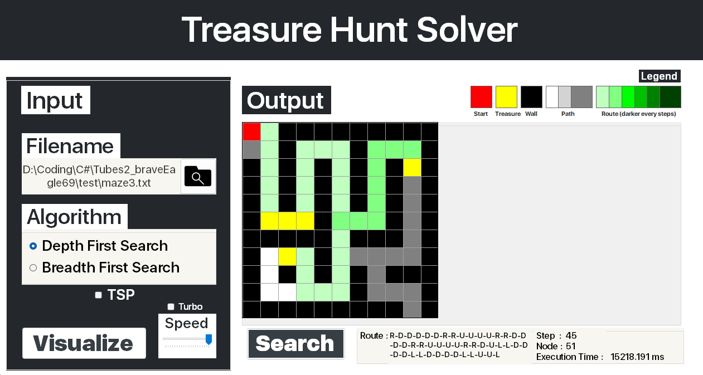

# Treasure Hunt Solver
> Treasure Finder Any%


Have you ever played a game where you have to find your way out of a maze? Well, in computer science, we have to solve that same problem using algorithms. Two popular algorithms for solving mazes are Breadth-First Search (BFS) and Depth-First Search (DFS). And in this project, we'll be using C# and .NET Framework to develop our own maze solver using both BFS and DFS algorithms.

Our goal with this maze solver is to find a path that will lead us to all the treasures hidden within the maze. BFS is like searching the maze level by level, while DFS is more like exploring a particular path as far as we can before backtracking and trying another path. It's going to be a fun project, and we can't wait to see our maze solver in action!


## Requirement

Visual Studio 2022

```
https://visualstudio.microsoft.com/
```
C#

```sh
https://www.microsoft.com/en-us/download/details.aspx?id=7029
```
.NET Framework 4.7.2

```sh
https://dotnet.microsoft.com/en-us/download/dotnet-framework/net472
```
San Fransisco UI Display Font
```sh
src/resources/SFUIDisplay.zip
```

## Build Program
To build the Maze Solver program, follow these steps:

1. Clone this repository or download it as a ZIP file and extract it to your local machine.
2. Open Visual Studio 2022 and navigate to the cloned repository.
3. Open the solution file `Tubes2_braveEagle69.sln` in Visual Studio.
4. From the top toolbar, click on `Build` and then select `Build Solution`.
5. After the build process is complete, your executable file should be located in the `./bin` directory. Look for `MazeSolver.exe` in that directory.

## Run Program
To run the Maze Solver program, follow these steps:

1. Clone this repository or download it as a ZIP file and extract it to your local machine.
2. Build the executable by following the above instructions.
3. Open the `./bin/MazeSolver.exe` file.
4. Select the directory where your maze file `maze.txt` is located by clicking on the search bar.
5. Click on `Visualize` to display the maze.
6. Select either `Depth First Search` or `Breadth First Search` for your maze algorithm
6. Click on `Search` to display the solution.
7. Adjust the speed of the algorithm by sliding the `Speed` slider. You can also use `Turbo` to instantly complete the maze.
8. Activate the `TSP` toggle to find the solution to the Traveling Salesman Problem.


## Contributors

| Name | NIM |
| -------- | -------- |
| Alex Sander | 13521061 |
| Shidqi Indy Izhari | 13521098 |
| Mohammad Farhan Fahrezy | 13521106 |

